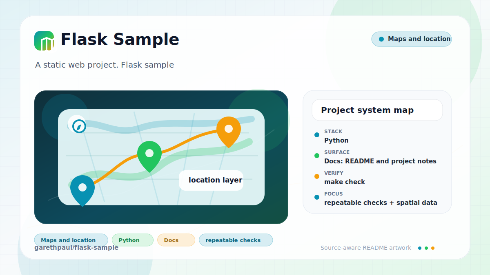

# flask-sample

<!-- README-OVERVIEW-IMAGE -->


## Overview

`garethpaul/flask-sample` is a static web project. Flask sample

This README is based on the checked-in source, manifests, scripts, and repository metadata on the `master` branch. The project language mix found during review was: Python (1).

## Repository Contents

- `README.md` - project overview and local usage notes
- `app.py`
- `requirements.txt` - Flask dependency compatibility range
- `Makefile` and `scripts/check-baseline.sh` - local verification commands
- `SECURITY.md` - security reporting and disclosure guidance
- `templates` - source or example code
- `tests` - root-route test coverage
- `VISION.md` - project direction and maintenance guardrails

Additional scan context:

- Source directories: templates
- Dependency and build manifests: none detected
- Entry points or build surfaces: app.py
- Test-looking files: no obvious test files detected

## Getting Started

### Prerequisites

- Git
- Python 3

### Setup

```bash
git clone https://github.com/garethpaul/flask-sample.git
cd flask-sample
python3 -m venv .venv
source .venv/bin/activate
python -m pip install -r requirements.txt
```

The setup commands above are derived from repository files. Legacy mobile, Python, or JavaScript samples may require older SDKs or package versions than a modern workstation uses by default.

## Running or Using the Project

- Run `python app.py` for local development. The app binds to `127.0.0.1:5000`
  by default.
- The root route is GET-only and renders `templates/hello.html`.
- Set `FLASK_DEBUG=1` only for local debugging.
- Set `FLASK_RUN_HOST` or `PORT` locally when you need a different bind host or
  port.
- Blank `FLASK_RUN_HOST` values fall back to `127.0.0.1`.
- Invalid `PORT` values fall back to `5000`.

## Testing and Verification

Run the baseline:

```bash
make check
```

The baseline compiles the app, runs the route tests, and verifies debug mode is
opt-in rather than hardcoded. It also verifies the root route stays GET-only and
startup port parsing falls back safely for invalid local environment values.
Blank host values also fall back to localhost. Responses include basic security
headers for content sniffing, clickjacking protection, referrer policy, and a
minimal Content-Security-Policy.

The `make lint`, `make test`, and `make build` aliases run the same local
baseline or unit tests while this sample has no narrower installed gates.

When the required SDK or runtime is unavailable, use static checks and source review first, then verify on a machine that has the matching platform toolchain.

## Configuration and Secrets

- No required secret or credential file is needed. Keep `.env` files local if
  future integrations add configuration.

## Security and Privacy Notes

- Review changes touching network requests, sockets, or service endpoints; examples from the scan include app.py.
- Debug mode is local-only. Do not expose the Werkzeug debugger on a public
  interface.
- Keep response headers such as `X-Content-Type-Options` and `Referrer-Policy`
  in place when adding routes.
- Keep `X-Frame-Options: DENY` in place unless a documented embedding use case
  is added.
- Keep the minimal Content-Security-Policy in place when adding new templates,
  routes, or external assets.

## Maintenance Notes

- See `SECURITY.md` for vulnerability reporting and safe research guidance.
- See `VISION.md` for project direction and contribution guardrails.
- See `docs/plans/2026-06-09-flask-get-only-root.md` for the GET-only root
  route contract.
- See `docs/plans/2026-06-09-flask-port-validation.md` for local port parsing
  guardrails.
- See `docs/plans/2026-06-09-flask-host-validation.md` for local host parsing
  guardrails.
- See `docs/plans/2026-06-09-basic-security-headers.md` for response header
  guardrails.
- See `docs/plans/2026-06-09-clickjacking-header.md` for the frame-embedding
  header guard.
- See `docs/plans/2026-06-09-content-security-policy-header.md` for the
  Content-Security-Policy header guard.
- Run `make check` before pushing Flask route or configuration changes.

## Contributing

Keep changes small and tied to the project that is already present in this repository. For code changes, document the toolchain used, avoid committing generated dependency directories or local configuration, and update this README when setup or verification steps change.
